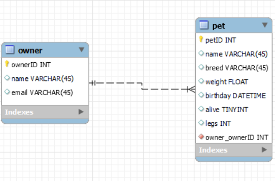
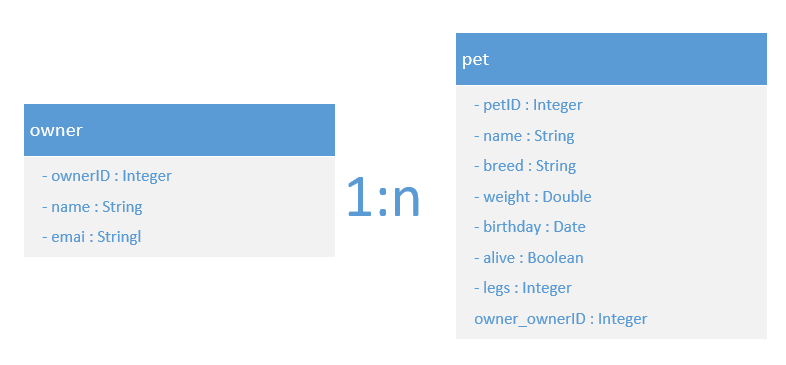

# Modul 295 LB Pet and Owner
## Description
"LB Pet and Owner" ist eine Java-Webanwendung, die Haustier- und Besitzerinformationen verwaltet. Sie bietet Endpunkte für CRUD-Operationen und enthält Authentifizierung und Autorisierung.

## Visuals
- **Database Diagram**: 




- **Screenshots of Tests**: Include screenshots of your test executions here.

## Validation Rules

Für die Erstellung eines neuen Haustiers gelten folgende Validierungsregeln:
### Pet:
- **name**: Der Name des Haustiers ist erforderlich und muss ein String sein. Er darf nicht leer sein und sollte weniger als 50 Zeichen enthalten.
- **breed**: Die Rasse des Haustiers ist erforderlich und muss ein String sein. Sie darf nicht leer sein und sollte weniger als 50 Zeichen enthalten.
- **weight**: Das Gewicht des Haustiers ist erforderlich und muss eine positive Zahl sein.
- **birthday**: Das Geburtsdatum des Haustiers ist erforderlich und muss ein gültiges Datum sein.
- **alive**: Der Status des Haustiers (lebendig oder nicht) ist erforderlich und muss ein Boolean sein.
- **legs**: Die Anzahl der Beine des Haustiers ist erforderlich und muss eine positive Ganzzahl sein.
### Owner:
- **name**: Der Name des Besitzers ist erforderlich und muss ein String sein. Er darf nicht leer sein und sollte weniger als 50 Zeichen enthalten.
- **email**: Die E-Mail des Besitzers ist erforderlich und muss ein gültiges E-Mail-Format haben.

## Permission Matrix
Describe the different roles and their permissions in your project here.

## OpenAPI Documentation
```yaml
openapi: "3.0.0"
info:
  version: "1"
  title: ""
  description: ""
paths:
  /resources/api/deletePet/{id}:
    delete:
      operationId: "deletePetById"
      description: ""
      parameters:
        - in: "path"
          name: "id"
          required: true
          schema:
            type: "integer"
      requestBody:
        content:
          application/json:
            schema:
              type: "string"
      responses:
        200:
          description: "exist"
          content:
            application/json:
              schema:
                type: "string"
        404:
          description: "does not exist"
          content:
            application/json:
              schema:
                type: "string"
  /resources/api/deletePets:
    delete:
      operationId: "deleteAllPets"
      description: ""
      parameters: []
      requestBody:
        content:
          application/json:
            schema:
              type: "string"
      responses:
        200:
          description: "All pets have been deleted"
          content:
            application/json:
              schema:
                type: "string"
  /resources/api/deletePetsByDate/{date}:
    delete:
      operationId: "deletePetsByDate"
      description: ""
      parameters:
        - in: "path"
          name: "date"
          required: true
          schema:
            type: "string"
      requestBody:
        content:
          application/json:
            schema:
              type: "string"
      responses:
        200:
          description: ""
          content:
            application/json:
              schema:
                type: "string"
        404:
          description: ""
          content:
            application/json:
              schema:
                type: "string"
  /resources/api/exists/{id}:
    get:
      operationId: "existsById"
      description: ""
      parameters:
        - in: "path"
          name: "id"
          required: true
          schema:
            type: "integer"
      responses:
        200:
          description: ""
          content:
            application/json:
              schema:
                type: "boolean"
        404:
          description: ""
          content:
            application/json:
              schema:
                type: "string"
  /resources/api/getPets:
    get:
      operationId: "getPets"
      description: ""
      parameters: []
      responses:
        200:
          description: ""
          content:
            application/json:
              schema:
                type: "array"
                items:
                  $ref: "#/components/schemas/pet"
  /resources/api/isAlive/{isAlive}:
    get:
      operationId: "getPetsByIsAlive"
      description: ""
      parameters:
        - in: "path"
          name: "isAlive"
          required: true
          schema:
            type: "boolean"
      responses:
        200:
          description: ""
          content:
            application/json:
              schema:
                type: "array"
                items:
                  $ref: "#/components/schemas/pet"
  /resources/api/name/{name}:
    get:
      operationId: "getPetsByName"
      description: ""
      parameters:
        - in: "path"
          name: "name"
          required: true
          schema:
            type: "string"
      responses:
        200:
          description: ""
          content:
            application/json:
              schema:
                type: "array"
                items:
                  $ref: "#/components/schemas/pet"
        404:
          description: ""
          content:
            application/json:
              schema:
                type: "string"
  /resources/api/postPets:
    post:
      operationId: "addPet"
      description: ""
      parameters: []
      requestBody:
        content:
          application/json:
            schema:
              type: "array"
              items:
                $ref: "#/components/schemas/pet"
      responses:
        201:
          description: ""
          content:
            application/json:
              schema:
                type: "array"
                items:
                  $ref: "#/components/schemas/pet"
        400:
          description: ""
          content:
            application/json:
              schema:
                type: "string"
  /resources/api/postPetsBulk:
    post:
      operationId: "addPetsBulk"
      description: ""
      parameters: []
      requestBody:
        content:
          application/json:
            schema:
              type: "array"
              items:
                $ref: "#/components/schemas/pet"
      responses:
        201:
          description: ""
          content:
            application/json:
              schema:
                type: "array"
                items:
                  $ref: "#/components/schemas/pet"
        400:
          description: ""
          content:
            application/json:
              schema:
                type: "string"
  /resources/api/{id}:
    get:
      operationId: "getId"
      description: ""
      parameters:
        - in: "path"
          name: "id"
          required: true
          schema:
            type: "integer"
      responses:
        200:
          description: ""
          content:
            application/json:
              schema:
                type: "string"
        404:
          description: ""
          content:
            application/json:
              schema:
                type: "string"
  /resources/api/putPets/{id}:
    put:
      operationId: "updatePet"
      description: ""
      parameters:
        - in: "path"
          name: "id"
          required: true
          schema:
            type: "integer"
      requestBody:
        content:
          application/json:
            schema:
              type: "string"
      responses:
        200:
          description: ""
          content:
            application/json:
              schema:
                type: "string"
        404:
          description: ""
          content:
            application/json:
              schema:
                type: "string"
components:
  securitySchemes: {}
  schemas:
    owner:
      properties:
        ownerID:
          nullable: false
          type: "integer"
        name:
          nullable: false
          type: "string"
        email:
          nullable: false
          type: "string"
    pet:
      properties:
        petID:
          nullable: false
          type: "integer"
        name:
          nullable: false
          type: "string"
        breed:
          nullable: false
          type: "string"
        weight:
          nullable: false
          type: "number"
        birthday:
          nullable: false
          type: "string"
        alive:
          nullable: false
          type: "string"
        legs:
          nullable: false
          type: "integer"

```

## Author
- Jia En Chuah
- jia-en.chuah@ubs.com
- Github: https://github.com/chuahj-bzz/m295lb

## Summary

"LB Pet and Owner" ist eine Java-Webanwendung, die auf dem Spring Boot Framework basiert und Maven als Build-Tool verwendet. Die Anwendung verwaltet Informationen über Haustiere und ihre Besitzer. Sie bietet CRUD-Operationen (Erstellen, Lesen, Aktualisieren, Löschen) über verschiedene Endpunkte an.

Die Anwendung implementiert Authentifizierung und Autorisierung, um sicherzustellen, dass nur berechtigte Benutzer Zugriff auf bestimmte Funktionen haben. Sie verwendet MySQL als Datenbank zur Speicherung der Daten.

Die Anwendung enthält auch eine Reihe von Tests, um die Funktionalität der Endpunkte zu überprüfen. Diese Tests verwenden das HttpClient-Framework, um HTTP-Anfragen an die Endpunkte zu senden und die Antworten zu überprüfen.

Die Anwendung hat spezifische Validierungsregeln für die Erstellung neuer Haustiere und Besitzer. Diese Regeln stellen sicher, dass alle erforderlichen Informationen vorhanden sind und im richtigen Format vorliegen.

Die Dokumentation des Projekts, einschließlich der OpenAPI-Dokumentation, befindet sich in der `README.md`-Datei des Projekts.